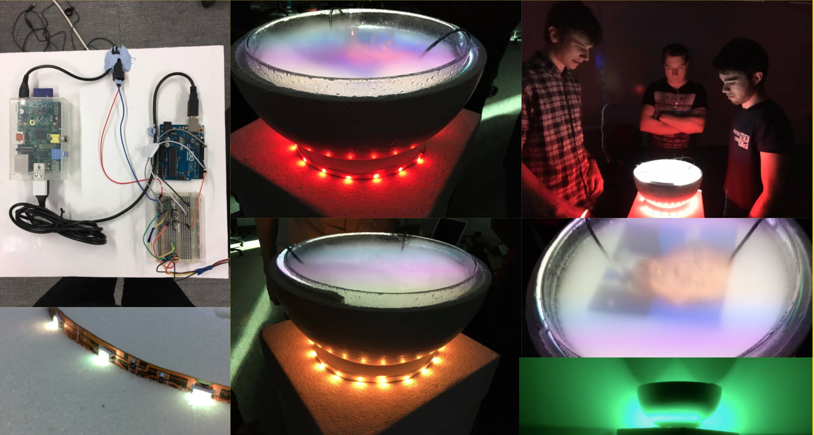
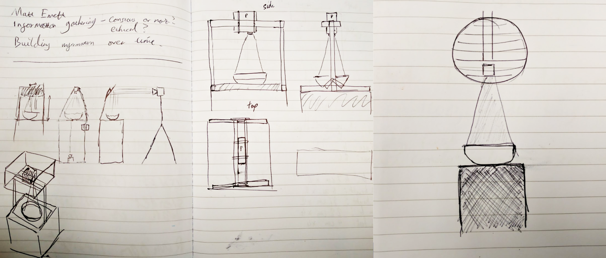
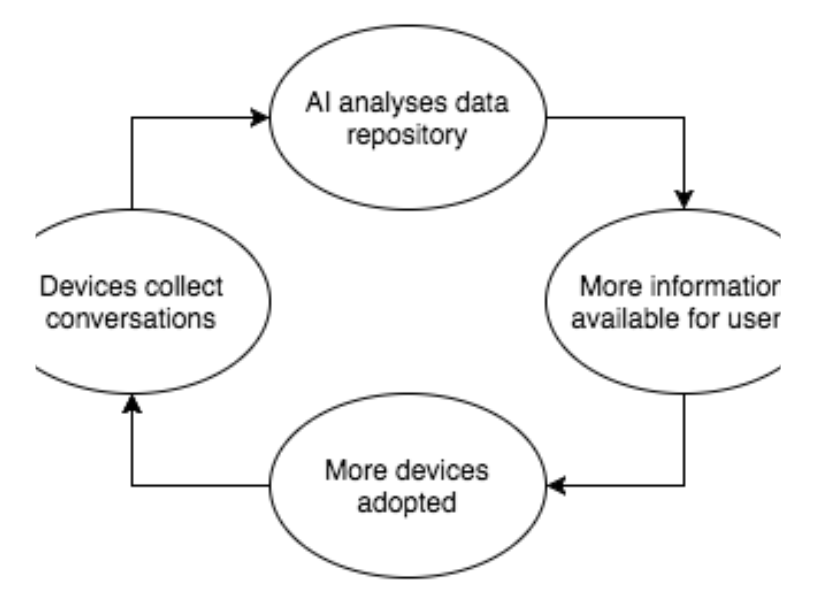
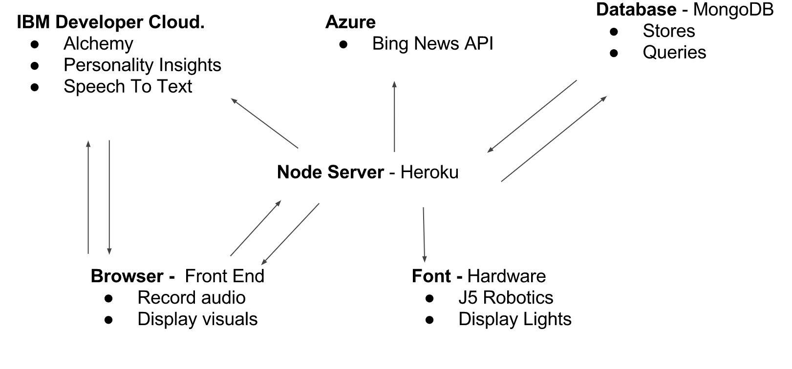
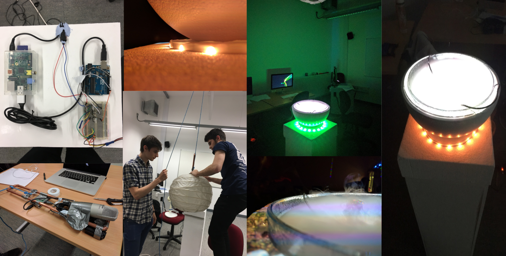

We started to draw up ideas about the physical structure of the device. Following previous research on [Designing the Connected Everyday by Elisa Giaccardi](joshua.jarvis.co.uk/designing-the-connected-everyday), we decided to transcend the digital screen and comply with our concepts of creating a magical experience by removing all presence of technology and project onto the water. As mentioned previously, water in a font has the religious connotations as well as the calming relaxing effect on the environment. Here are our early concepts.

We wanted the device to be simple and movable, allowing it to be robust enough to perform and display in any environments, therefore we designed a contained system. We came to the solution of displaying the font at waist height, so the view can look down into the bowl to gain insight into the conversational context, or talk over the bowl. By allowing users to communicate uninterrupted by the device was important as we do not want to distract from the conversation. The device also has to be symmetrical, and allow a conversation to flow around it from any side since users can be stood anywhere around the device.

Upon reflection, we decided to remove the rails either side of the device which were supporting the projector, this is because they creating obstruction from clear communication, as the rails blocked the view of the person stood opposite. We decided to suspend the device from the ceiling, meaning the projector, microphone and pi now had a weight limit to them. This reduces the robust mobile movement of the device.

### Development

We broke up the physical development into two parts. The base, of which consisted of the plinth, font and containing technology. And the top, of which involved the projector, microphone and technology required to run them. During building, we found these things:

These are ultrasonic mist makers, and essentially vibrate the water into vapour, creating a screen of mist over the bowl. This proved a much more interesting medium to project onto. Water seemed troublesome since it reflected the projector's light. The mist provides a clear canvas with natural movements and motions. Also, if there was soo much movement, sudden shouting or large disturbances the mist would be blown away, promoting a still calm expression and body language to view the projected contextualised data.

Development of the system involved two Raspberry Pi's, one Pi3 to display the front end browser to the projector and use the microphone to convert speech to text. The second Pi1 was embedded into the font to control the Arduino's LED colour changing lights.

The lights represented the conversations personality, changing colour depending on the surrounding personality. The lights use a traffic light system of red, yellow and green, this is due to its diverse cultural recognition. Red denotes if the conversation is not optimal in the eyes of the big 5 personality traits, yellow would denote that the conversation is sufficient but not optimal, and green would denote that the conversation is perfect. Secondly, the lights would flash to denote that the current topic of the conversation has changed, proving as a notification system to the participants that they have gone off topic. The participants can choose to ignore this since changing topics is a function of natural conversation.
We chose to use lights to represent these systems due to their impact on the environment and create an unobtrusive notification system. They do not obstruct the conversation, of which can still flow to get back on topic, but just notify the participants.

The challenge for building the physical structure was to abstract all recognition of technology. Meaning we had to remove all wires and visible tech to help us achieve this device that seems magical. To achieve this, we have one cable going to the font to power all the tech, this slips into the base of the plinth and the wires are embedded into the system so nothing is showing. The top part that holds the projector is contained in a lampshade to hide the technical components.

From the point of view of a user, the device has no external wires or leads and just exists as an entity. When we showed it off, people naturally gathered around it to communicate about the project, so our goals of creating a device that promotes gathering and communication were hit.

As mentioned before, the projector is used to display a browser in kiosk mode, so our visual development was all done in javascript canvas. The browser records the conversation and streams this to IBM's Watson Speech to text service, turning the speech into text, this is then streamed back to the browser.

The browser, with the text conversation, then posts this to our API system. We built our API system in Node using Express, this is to efficiently deal with the massive load of requests during the streaming of the conversation, deploying this system to Heroku.
Once the API receives the conversation text, it collects it in packets of 200 - 600 words and posts this to IBM Watson for analysis.

### Using Artificial Inteligence

The first AI service of Watson we use is the Personality Insight system. This gives us insight into the personality of the conversation through the big 5 personality traits. We post our data from the node system to the service via HTTP and search the response to see if any of the personality traits and sub-optimal. If they are, we send a signal with the overall score of the effectiveness of the conversation through the web sockets. This is picked up by the Pi1 in the base of the plinth and changed the lights accordingly to the effectiveness of the conversation. Running on the Pi1 is Johnny5 a Javascript IOT framework used to access electronics like the raspberry Pi using Firmata. Meaning we could control our physical devices with Javascript and not have to encode or decode JSON data coming in from the Websocket.

The second service we use is IBM's Alchemy API. This is the underpinning service that we use to analyse the conversation. Alchemy returns the conversations topics and subjects. From this, we take the 3 most prominent topics and find details regarding them using DBpedia, getting unbias images as a result. Meaning we can display images of the topic being talked about. Using WebSockets, we stream the images related to the topic being talked about to the browser, of which then cycles through the images displaying contextual information of the topic. Websockets are also sent to the lights to flash if the previous topic is no longer relevant in the conversation to signify they the current topic has changed.
Finally, this data is stored in a Mongo Database, with the topic and all relating topics. Currently, in the system, we do not access the previously stored data, since we don't have any. Being a new device prototype, we don't have extensive data about topics and conversation, therefore we needed a way to display contextual information to make it appealing for people to still use the system.

We chose to display news article headlines and decided to use a news API to display the most recent news related to the topics that are being discussed, giving relevant up to date context to the conversation. We started to look for news API systems.

The first candidate was the Google news API, although we found this has been depreciated. So we tried to write a script that would search Google news for a query and scrape the resulting headlines. This proved difficult and inefficient so we dropped this and searched for another API service.

We then found IBM's Alchemy API had an integrated news service, allowing us to find articles related to the topics being discussed. This proved troublesome since the API allowed historic searching for articles, and each article search used our API call credits, meaning our keys would expire instantly if the service returned a load of historic news systems. We tried to combat this by using multiple keys and looping through if the keys expired, this proved super inefficient and ruined all of our 24-hour keys. The worst part about this that IBM had no documentation for this and we only found this out after posting on their forums.

Finally, we came across Microsoft's Bing News API, of which we could call via HTTP to get the most recent article relating to a subject

### Visualization

Displaying the data through projection onto the fog proved difficult. After vigorous testing, we had to remove all visual effects on the page and display a simplified version. This was because the images and text blurred due to the constant movement of the fog. Images were used where possible to display the surrounding topics of the current topic. For example, if the conversation involved the US, we would display an image of President-Elect Donald Trump, as these topic are similar. This would eventually be facilitated by the database, proposing similar topics through images. Since our database is not as extensive as is required, we are instead using DBpedia to present images of similar topics. This keeps the unbias contextualization of the conversation but does not have the collaboration aspect, as these related topics could change depending on contemporary events. This does work to prove that we can show relationships of topics while the database is being filled up with conversations.

To show this data, we plan to show images of related topics where necessary. Images are much more recognisable and require less concentration to view, this will reduce the amount the font takes away from the conversation.

We aim to display the contextual new article headlines in the font as unobtrusive, meaning it is optional to read. These articles will loop, meaning it is not required to pay attention and understand all of the text, they will loop around again. We aim to display the headlines in a [Spritz method](http://spritzinc.com). By showing one word at a time all around the 4 sides of the device allow everyone around the device to have the option to read the article headline. We chose to display headlines as this gives a general sum of the article in a very short sentence. The aim of this is not to display the contents of the article but remind to display the related information. We Chose to display 200 words a minute, this allows them to fly past in rapid succession but is 100 words a minute below the average ability (according to Spritz).

<iframe src="https://player.vimeo.com/video/199363008" width="640" height="352" frameborder="0" webkitallowfullscreen mozallowfullscreen allowfullscreen></iframe>