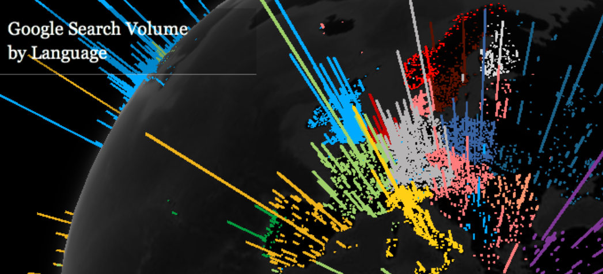
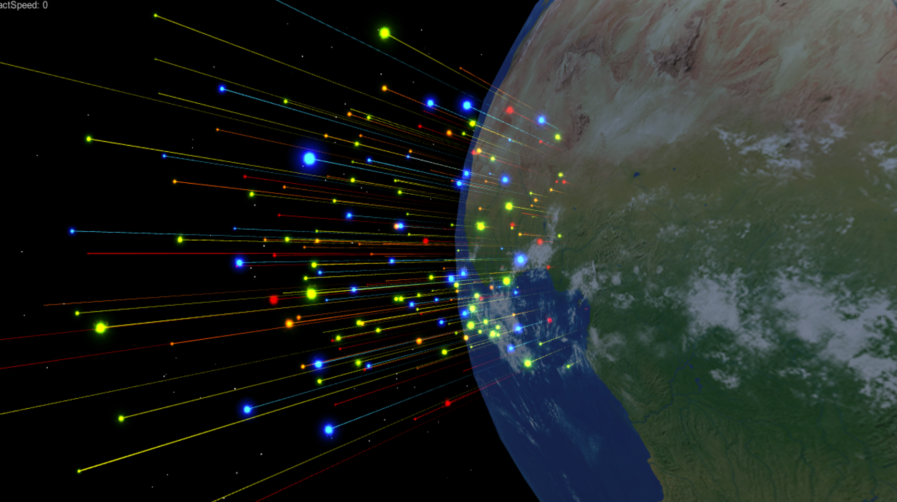
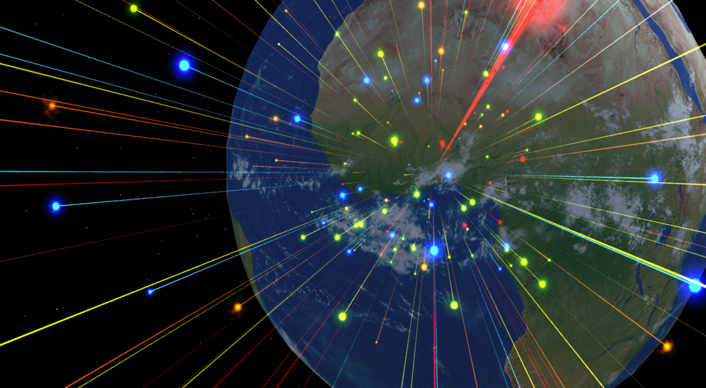
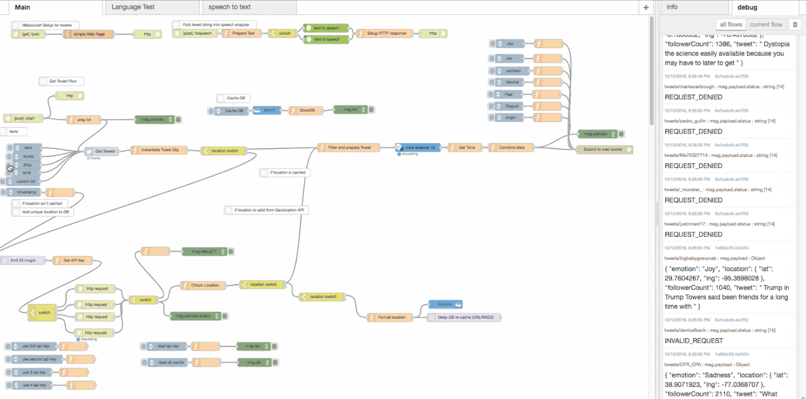
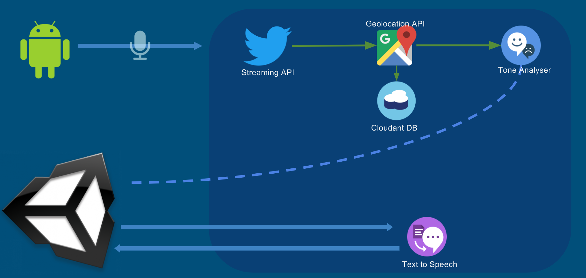

The WebGL Globe Chrome experiments created by Google visualise global open source datasets. The visualisations interested us as they improve the map-based visualisation by requiring a clear interaction, utilising the keyboard and mouse input of a browser. The interaction allows a user to navigate the globe, looking at the entire dataset and zoom/focus on a particular strand of data, allowing the user to compose the visualisation relative to the areas of the subject that interest them.

The interaction from the WebGL experiments works perfectly in a browser setting, utilising the typical inputs to a browser and representing data visually. More data can be seen this way as the interactions promote exploration in the scene, creating a rudimental experience of the data rather than just a 2D visualisation. To create an experience in our visualisation we wanted to transcend the 2D interactivity of these contemporary browser based visualisation and rely heavily on strong user interaction and create an exploration with a time-based narrative.

We looked at visualisation that utilises an experience to invoke a feeling or greater understanding of the data, the visualisation that interested us most was the LoVR Virtual reality project created by Immersive.
<iframe src="https://player.vimeo.com/video/133294743" width="640" height="360" frameborder="0" webkitallowfullscreen mozallowfullscreen allowfullscreen></iframe>

The combination of sound and visual design in this piece exceptionally portrays the feelings and emotions, causing the audience to empathise with the narrative being presented. The time-based native also helps present the data, allowing a user to follow the flow of the data to understand the hidden meaning behind the set of data. This works as the dataset isn't presented all at once, potentially overwhelming the experience, but instead trickled down to the viewer allowing them to grasp the current snapshot and make cognitive comparisons between the segments/frames of data being displayed.

Being in Virtual enhances the experience, as similar to the WebGL experiments, LoVR allows user interaction to focus on points of data or to 'zoom out' to look at the composition as a whole. Unlike the WebGL browser based media, utilising VR allows a physical interaction, incorporating the user in the experience by generating the scene around them in 3D space further pushing the empathetic phycological response to the visualisation. LoVR seems to transcend the observer of data relationship creating a narrative driven performance of the data, this is something we should incorporate in our own visualisations if we wish to create a strong narrative based experience of the data.

### Concept

We were inspired by how the echo chamber effect removes an individual's ability to understand the global opinion pool, and how the effect is present in the modern day being catalysed by the introduction of social media and confirmation bias. We wanted to create a real-time narrative of the news topics transcribed secondhand hand by individuals re-reporting primary sources of information over social media, using their reactions to topics as our vector in presenting geolocated opinion biases.

For this, We decided to focus on opinions of individuals and the sentiment related to them. By giving a topic or query we would scour the opinions and calculate an emotional sentiment. This sentiment would give us a generalisation of their stance on a topic or situation, also, with enough of these opinions being streamed in real-time we would also create a live narrative of the current happenings of an event or subject, here we can see the loop of opinions related to a topic change and shift relating to the real-time unfolding of an event. This data would be mapped in time and space to give a global view of the opinion base.

### The Process

So we have a solid concept, our first challenge was finding how we're going to stream real-time opinion in mass. We needed a platform that we can record individual opinions, and to overcome the echo chamber effect these opinions had to be mixed. We conducted research and looked into grabbing news reports from worldwide outlets that tend to lean towards different biases or political spectrums, but this wouldn't give us the mass amounts of opinions, thus we moved to social media and looked into utilising this to get as much opinion base as possible - Twitter became a huge candidate for this.

We quickly found that representing emotions in all cultures is an impossible task as each culture regards emotions differently, and there is no definitive set of emotions and what they represent. So, being a contemporary installation, we decided to use a western based emotion system and use the 5 emotion theory, these being joy, sadness, anger, disgust, and fear. From this, we then defined a colour system that related to the emotions. To achieve an accurate colour system we looked at pop culture in western media and took the inspiration from large outlets such as Disney, who have used colour based emotion in their movies of which are hugely popular in western culture, therefore many people already subscribe to the Disney theory of displaying emotions.

We decided to investigate an innovative controller for the piece, to make navigating the visulisation as intuative as possible. Presenting out piece in a Immersive Vision Theater Half Dome the controller would also need to be easily passable among the viewers since the dome can seat many people, it would be nice to allow the controller to be passed along the rows so each individual can have their own immersive experience.

We initially looked into using leap motion to create this interaction and got to work implementing it. Allot of time was put into developing a working leap motion system, this proved to be difficult since the leap SDK for Mac has been depreciated and the documentation was small and no longer active. Nevertheless, we managed to get a simple system working and tested it in the dome.

We found that the leap motion, although it looked amazing, didn't allow for natural intuitive control since a set number of gestures had to be learnt before one can naturally navigate and interact with the product. Secondly, there was a few bugs and issues in the leap plugin for Unity that made it almost unusable. After a discussion we decided to drop leap support due to these reasons, also the leap didn't seem to suit the 'easily passable controller' criteria that we had defined.

In desperation, we started looking into other technological solutions such as getting gesture controls from a Myo Bracelet, but again we would also need a gesture system in place to capture it, making it unnatural to learn and interact.

Since we're representing a globe the functional solution came to us pretty quickly, create a physical globe to control the digital. That way we can have a physical sphere that a user can hold and move causing the same movement on screen in the dome. Being a ball the device could also be mobile, allowing for the controller to be passed through the room so each and every person has a chance to imprint on the composition themselves.

<iframe width="560" height="315" src="https://www.youtube.com/embed/1qE47lVsXnc?rel=0" frameborder="0" allow="autoplay; encrypted-media" allowfullscreen></iframe>

### My Role

My role in this project was to create an efficient web API to control the entire data collection and analytics. The system is created in a node-red flow and hosted on IBM BlueMix, this is so we have access to the entire machine learning and artificial intelligence systems provided my IBM.

When making the backend system, I had a scalable API like system in mind with a manner of endpoints that can be called from any system to request data. This wouls allow us to have multiple systems subscribe to incoming data and send requests to the system. This worked out perfectly since we used two devices (unity and mobile) to access the backend. The reason a backend was created is to keep a strong separation of concerns, it could be do-able in the unity app, but with presenting and processing data the app would begin to hit some choke points quickly. By utilising another hosted service these choke points can be removed from the system.

With a decoupled API like system it would also be feasible in future to add more social networks such as facebook and even other media outlets, making the backend system future proof. The backend system works by receiving an HTTP post request from the mobile device with the search query. This query is placed inside of the Twitter streaming API on the backend and thus Tweets come streaming in.

Once Received I grab the Tweet, users location (if applicable, if no location is available we discard the tweet), and follower count. From here I use the Google Geolocation API to turn the physical location (like Plymouth England) to a lat/long coordinate, this allows us to map the tweet on the position on the 3D earth in unity.

Once we have a valid lat/long position (invalid positions are discarded) we send the tweet through the IBM Watson AI ToneAnalyser. This responds with scores against the 5 emotion. We do some calculations to test if the tweet is neutral (ie all emotions are the same) and get the strongest emotion. Here we stream all of this data down to Unity through a WebSocket.

We then have a second endpoint that allows unity to call the backend again with the tweet text, allowing the backend to convert the text to voice. This is then sent back via the HTTP response. The reason this section is separated is that converting and sending audio takes a while, and was originally slowing down the processes, by utilising HTTP we can make multiple request when unity is ready rather than shoving too much data into unity through a WebSocket.

The Biggest issue we have with this system is that the Google Geolocation API blocks if more than 50 requests are made per second, or 2500 requests are made in a day. Since with some queries we could get up to 100 Tweets a second this is something we had to fix.
My first step was to implement a database that caches common locations, such as London England, or Washington DC with their lat/long meaning the system firsts queries the database to see if there is a cached lat/long for its location before calling Google's API.

### Conclusion

 Our success criteria was met, we realised that when testing the experiance during the 2016 American Presidential election. Throughout the process during press events and even the debates we ran the product with the Trump query and could guess the outcome of the debates through the reporting and opinion sentiment from the project. Sometimes we'd receive so much data from the Trump query the backend system would collapse, unable to process everything at once.

What amazed me the most was how accurately it related to the echo chamber, when running the app location obviously related to the opinion, and some location such a rural America created opinions that differ greatly from other locations.

The only issue with the tool being used politically is that social media does not reflect an entire population. A large proportion of an older population don't use social media, and their opinions are not represented in the app. Arguably this is causing an echo chamber among a younger generation who use social media and ignoring the non-social media using population. This is why in future developments it would be nice to transcend the online world of social media and harvest data from traditional media sources and news outlets.

<iframe src="https://player.vimeo.com/video/195970271" width="640" height="352" frameborder="0" webkitallowfullscreen mozallowfullscreen allowfullscreen></iframe>
