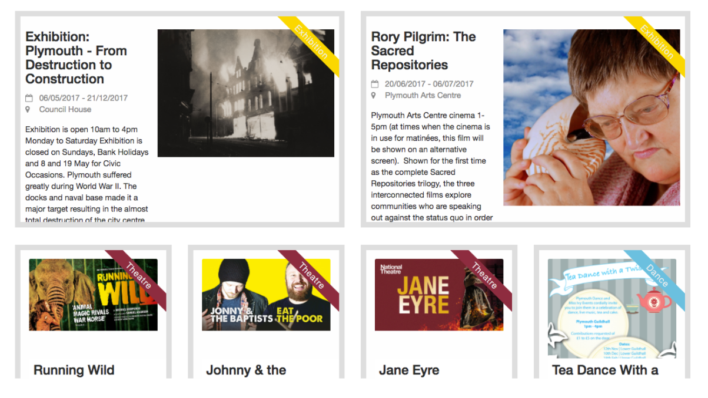

While working with the Creative Summer Studio I worked on prototyping an app using progressive web app technologies and serverless solutions. Artory is a mobile platform where users can login to discover and book events in arts and culture.

<iframe src="https://player.vimeo.com/video/114340188" width="640" height="360" frameborder="0" webkitallowfullscreen mozallowfullscreen allowfullscreen></iframe>

[Artory: The ultimate guide to Plymouth&#039;s Culture - Available Now](https://vimeo.com/114340188)

The motivation behind producing a PWA was to combine the app and mobile experience. I created a prototype using Angular, using the recently released NG-CLI to bootstrap a PWA, setting up service workers to cache communication with a REST API providing offline support. The app allowed users to submit comments, tasks and review, all where recorded and logged when offline and submitted when a connection was established.
The prototype I produced was installable, using a lightweight app shell to provide a native experience and cashing event listings in the case of a slow network connection. To reduce perceived loading time, methods such as image preloading (loading a low resolution image while the high res image renders) and skeleton loading animation where used. The performance of the app was also benchmarked using Google Lighthouse in order to ensure a small payload was produced.

The original mobile app used a Django backend, so to reduce maintenance costs I was tasked with researching serverless technologies. Since the event data was gathered from an external source, I investigated Firebase for handling the user login/data flow, allowing social login to tie the user accounts with social media.

I produced and hosted a prototype app on firebase that represented the possibilities of using PWAs and Firebase, along with producing technical documentation, including tutorials on how I produced the prototype along with example of how the existing app could be transitioned.

