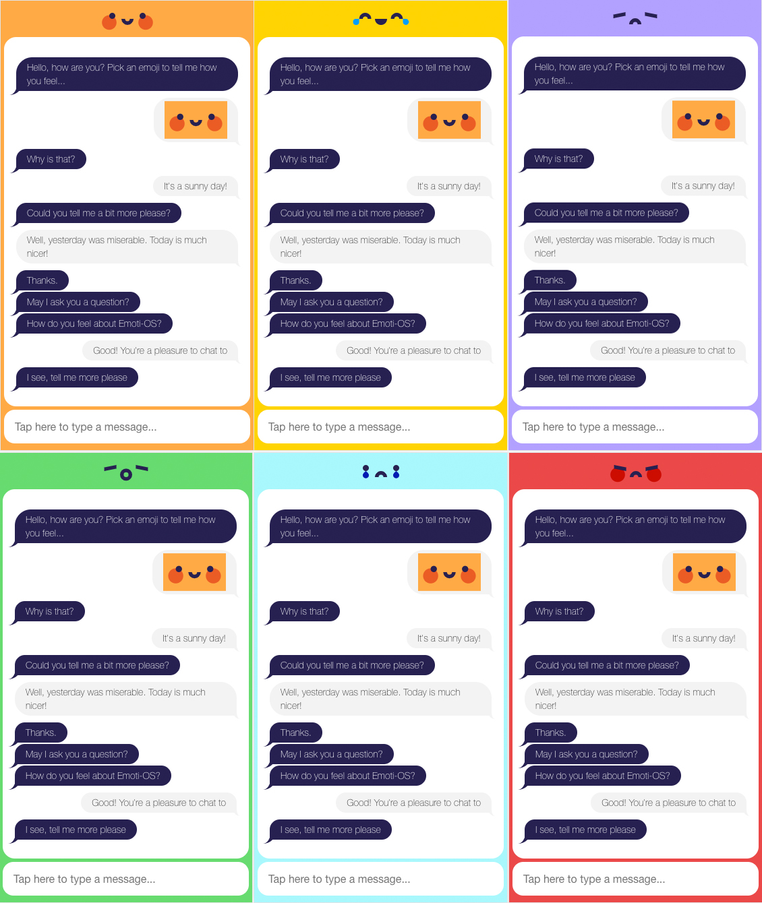

While working with the Creative Summer Studio at Plymouth University I had the pleasure to create the Emoti-OS site, a Wordpress installation with a custom theme.

<iframe width="560" height="315" src="https://www.youtube.com/embed/GnnjwF9W-VM" frameborder="0" allow="autoplay; encrypted-media" allowfullscreen></iframe>

Emoti-OS uses conversations with its users to understand the collective mood of pupils at Plymouth School of Creative Arts (UK). It is created for and by these pupils to give students a voice and a way to express how they collectively feel about important matters at the school

The site had to be optimised for mobile and desktop and present a instant message interface with the chatbot. Using WebSockets live streams of text analysis has to be handled efficiently in the browser while providing a clean and fun interface.

In this project I had experience implementing external vector graphics and experimenting with CSS and browser animations to give ‘personality’ to the chatbot.

