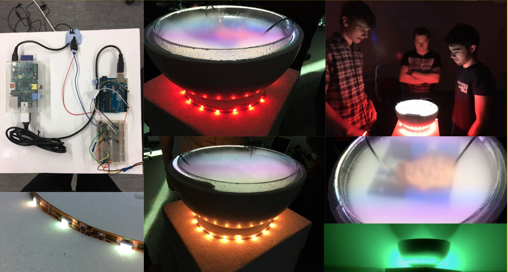

A final year University project, investigating theory of conversation and the data that can be extracted from physical spoken communication. Drawing on inspiration from historic representations of Seers and Divination, our aim of subverting the typical conventions of data mining and analytics by abstracting all technical aspects and presenting the system as 'magic', was to achieve a supernatural representation of Artificial Intelligence.

<iframe src="https://player.vimeo.com/video/199363008" width="640" height="352" frameborder="0" webkitallowfullscreen mozallowfullscreen allowfullscreen></iframe>

The font contains a multi-directional microphone to record the surrounding conversation and stream it to a node server hosted in Bluemix, using IBM Watson's Speech to Text service, text is derived from the conversation and analysed through Watson’s Personality Insight system, as the conversation evolves more requests are made to confirm the context of the conversation.

Once the context is derived, we analyse the sentiment by topic basis and monitor the conversation flow to represent this in the light emitted by the base of the font. With the topical gathered from the conversation, we collect context about the topic.

We throw the top topics into DBpedia, an open source information wikki, here we can collect images, text and related topics. We also conduct a search into recent news articles, streaming in new articles about to topic to the font.

The node app conducting this research also stores the masses of conversation flow in a MongoDB, allowing it to be analysed later. Express is also used on top of Node to provide a web canvas visualization to project the data in the font.

Text and images are projected from a hanging projector hidden under a paper shade into the font. Two ultrasonic humidifiers are used in the water to create a creamy mist that settles at the rim of the font providing a clear and mystical canvas for the projection. Running on a Raspberry Pi embedded in the paper shade, the web Canvas visualization is designed to run efficiently and without latency, using basic browser animations and opting for efficient processes to prevent latency.

