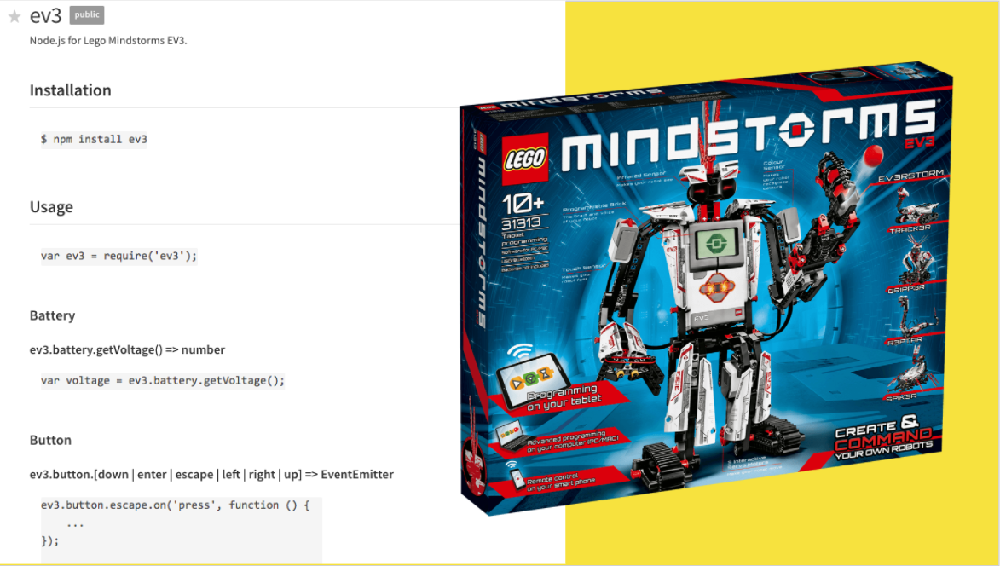
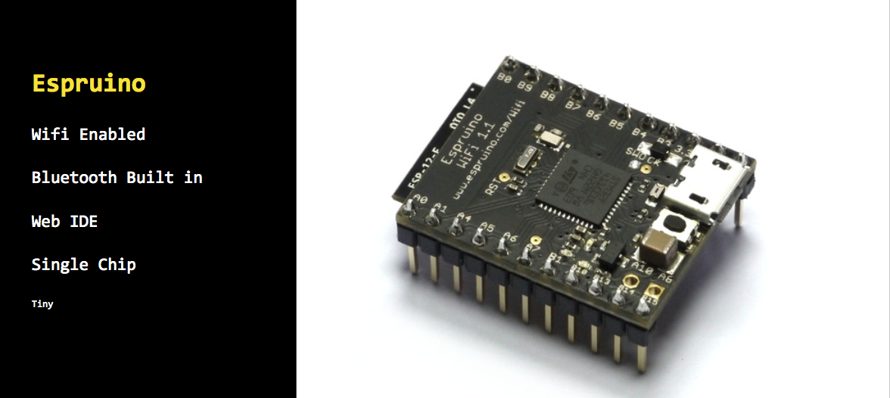
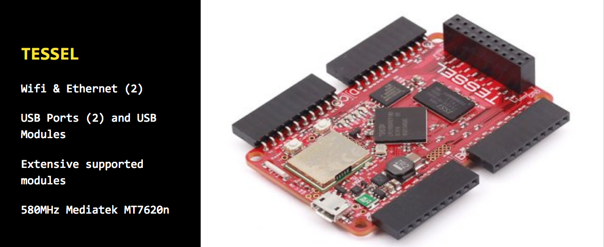
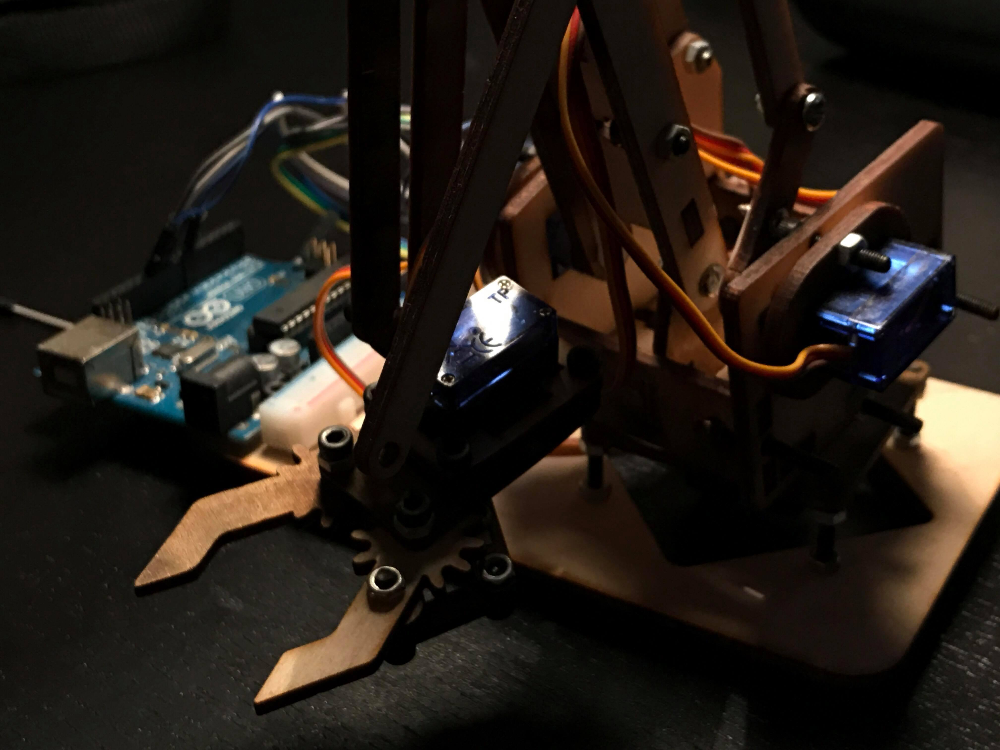

I have used Node.js in embedded systems for a wide variety of projects, both in and out of my degree, and still continue using it for various DIY IoT systems I use on a day to day basis. So, along with a friend and fellow Node-robotics enthusiast [@ChrisWoollon](https://twitter.com/ChrisWoollon) we decided to produce a short talk at Plymouth JS, our local meetup. This post will cover the topics we highlighted in the talk we gave.

Why would one use Node in embedded systems, especially when the alternatives such as Python, or C run much more efficiently than running the heavy V8 engine, is a good question, and one I often get asked alot.


**Advantages**
JavaScript currently is one of the most popular languages, being picked up by many newcomers to programming due to its low barrier to entry and job opportunities, meaning many people have skills in the language so naturally this is their language of choice when trying to work with embedded systems.
With a large adoption rate comes a large variety of libraries, packages and frameworks, a few of my favourites include a Node wrapper for the Lego MindStorm API - [E3.js](https://www.npmjs.com/package/ev3) and [Node SerialPort](https://www.npmjs.com/package/serialport) for communicating to technologies through serial.

Adapring from browser animation and efficient streaming processing, JavaScript actually suit the embedded systems architecture quite well, subverting typical conventions of embedded programming and posing a fresh unique solution to many problems in robotics.

Finally, web combined with other Node systems, such as a server, calling APIs, communicating with browsers, the data flow becomes much simpler. Being able to query a MongoDB and pass that data through various external requests and using the payload directly without serialization is a huge time saver and allows one to efficiently maintain state in the stack.



**Memory Allocation**
The issue with using Node is that it runs on the V8 engine, following this answer, the absolute minimum for *normal* running is 20-30mb, although this is true, the actual memory usage depends on the app being run. Usually, a device such as a RaspberryPi is compatible, with a memory capacity of 248mb it is possible to run Node and other processes. On devices with a smaller memory allocation Node can be configured to use less memory with passing <code here> flags when running a process.

Also, the V8 engine isn't the only option when running node…

[Duck tape](http://duktape.org/)
“Duktape is an embeddable Javascript engine, with a focus on portability and compact footprint”


[Espruino](https://www.espruino.com/) boards have an integrated JavaScript compiler, allowing them to run their own simplified JavaScript version.


Another great example of a prototyping system that supports Javascript development is the [Tessle](https://tessel.io/), providing a neat NPM package and CLI for writing node.

**Libaries**
There are many tools in the NPM ecosystem that provide solutions for using node to interface with embedded platforms, the two primary frameworks are Johnny 5 and Cylon.

[Johnny5](http://johnny-five.io/) adopts a jQuery approach, using even handlers to listen to and trigger changes, the Hello World example is super simple, shaddowing jQuerys DOM operation model.

```
 var five = require("johnny-five");
var board = new five.Board();

board.on("ready", function() {
  var led = new five.Led(13);
  led.blink(500);
});
```

(Cylon)[https://cylonjs.com/] promotes itself as a framework, with more involved APIs that use an Object Literal design pattern. Although more complex than J5, Cylon creates a clear and isolate architecture, similar to componentization.

```
var Cylon = require("cylon");

// Initialize the robot
Cylon.robot({
  // Change the port to the correct port for your Arduino.
  connections: {
    arduino: { adaptor: 'firmata', port: '/dev/ttyACM0' }
  },

  devices: {
    led: { driver: 'led', pin: 13 }
  },

  work: function(my) {
    every((1).second(), function() {
      my.led.toggle();
    });
  }
}).start();
```


**Conclusion**
In my own experience, I have used a wide range of technologies relating to Node on embedded systems. The Font Project used Johnny 5 on a Raspberry Pi to communicate directly to a Arduino, interfacing with the Firmata library. During my AI Escape Room project, I used Node-Serial to send commands to systems, as well as make requests to external APIs, query my own Mongo Database and percist state through my Node server using WebSockets. For this talk, I produced a simple Node robotic arm, interfacing with an Arduino running Johnny5 to stream in data from external services in order to control the robot, showing the power of persisting state with sockets from web to the embedded platform.

