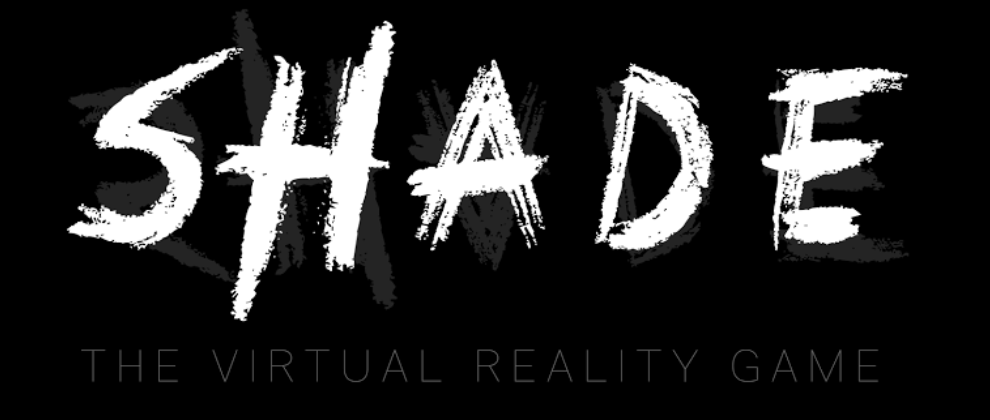
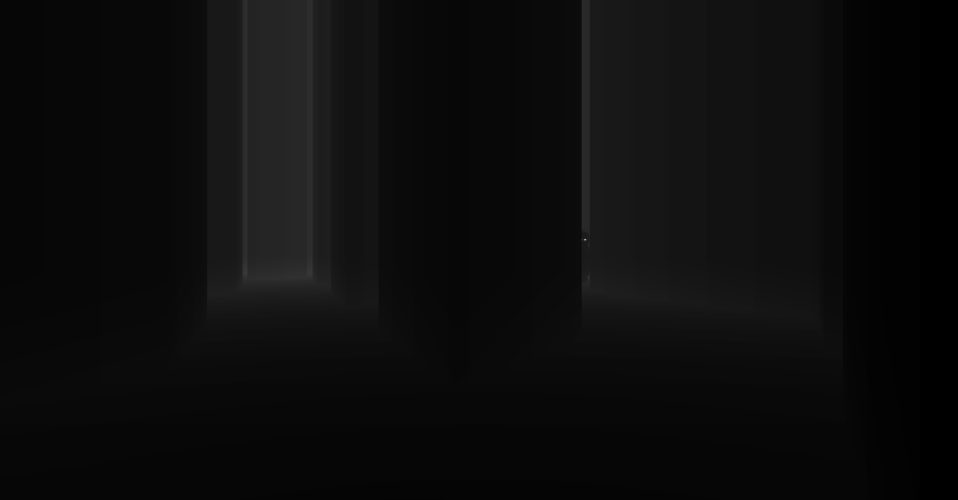
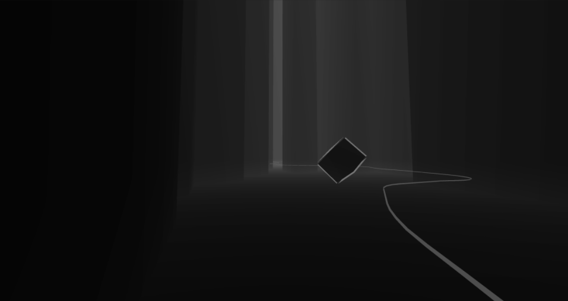
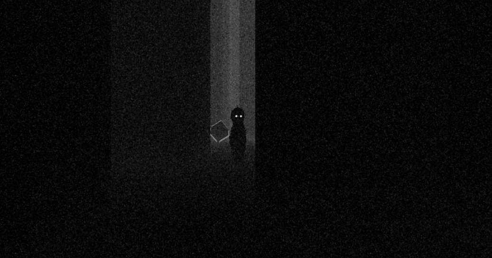
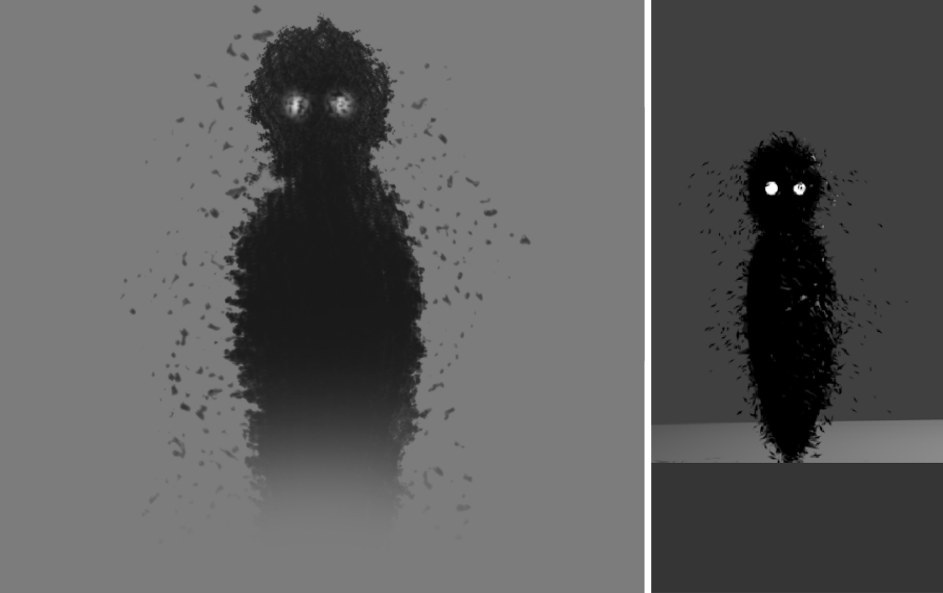
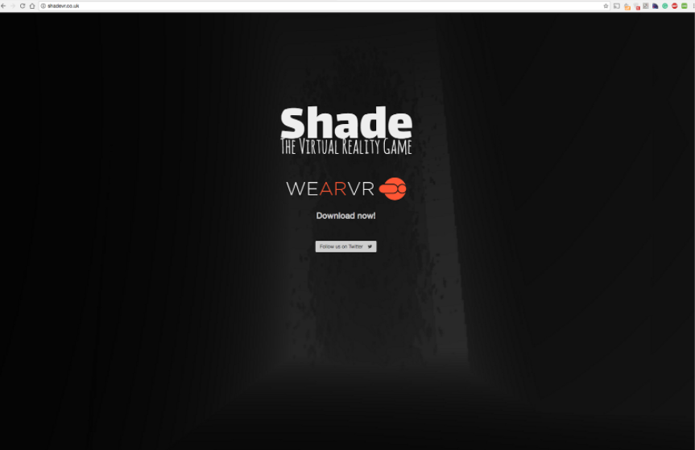

<iframe width="640" height="350" src="https://www.youtube.com/embed/6-TWs8l7XDo?rel=0" frameborder="0" allow="autoplay; encrypted-media" allowfullscreen></iframe>

Working in a team of two, we created and self published a Virtual Reality horror game for the Samsung Gear VR platform. Created in Unity 3D, the game generated a random maze during each playthrough and placed the player at its entrance. The goal of the player was simple, to get to the end of the maze while avoiding the Shade, the AI enemy.

Working in a team, we used source control and followed design patterns to structure the code, written Unity with C#. During development we encountered various methodologies for tacking problems, implementing A* pathfinding for the AI enemy, and using a algorithm to denote realistic 3D stereo audio to name a few.

My role in the development of the game was to lead the art style and interaction, creating simple assets to comply with the low processing power of the mobile VR platform but keeping a high quality feel. With this, we decided to keep to a dark pallet, using a low-poly style with little but optimised animations.

