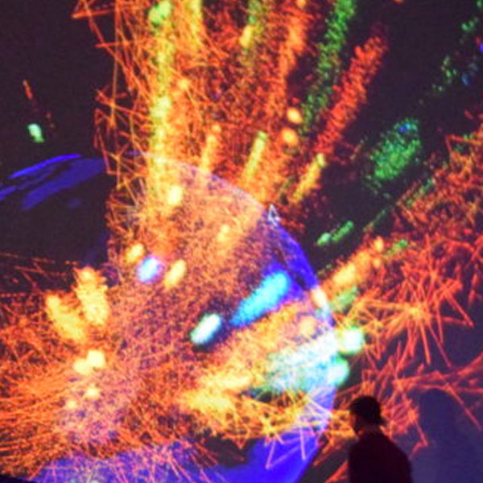

A classic example of a project I completed during my final year of University, in a group of 4, we were set the brief of ‘capturing the invisible’ using real time data.TwitterSphere uses various innovative technologies, combining them to create a unique interactive experience, immersing viewers through the visualization to present the data we captured.
The project used the Immersive Vision Theater at Plymouth University, a Half-Dome projection experience that fills the field of view of the audience to represent the location biases of social data. The audience were handed a physical ball controller, that they could spin and rotate to control the projected earth sphere.

The system we auchistrated used a phone embedded into the ball to stream the gyroscopic data to the visualisation created in Unity 3D - a game engine. The phone also recorded speech, allowing the user to send commands to the experience being able dictate the search criteria for the visualization.

The search query is then sent to an API we constructed in Node, from here the data collection and analysis begins. My role in this group was to lead the API development, here I created some basic endpoints using an API prototyping tool. Upon receiving the query, the subject was passed to the Twitter Streaming API, pulling in live Tweets on the subject matter, from this, we extracted information, such as the users set location (or their mobile co-ordinates if enabled), follower count, and the users Tweet message.

In order to get emotional context of the Tweet message, we used the Tone Analyser from IBM Watson, appling sentiment to the Tweet before streaming the Tweet to the Unity visualization through WebSocket. This Tweet was then displayed in real time as a coloured orb emitting from the Earth at the location it was Tweeted, depicting the sentiment through the visual and audible aura. User could use the ball controller to rotate the earth, navigating through hotspots of opinion and experiencing the shift of opinion through location on Earth.

This project became most powerful during the 2016 American Election, running the project during the live debate unearthed the location based biases of social media users, from city, state, and country.

During development, we were asked to keep a short documentation video:
<iframe style="margin-bottom: 3em;" src="https://player.vimeo.com/video/195970271" width="640" height="352" frameborder="0" webkitallowfullscreen mozallowfullscreen allowfullscreen></iframe>

---

### Some of the key issues we hit during development:

#### Getting the Twitter Location in Coordinates
This became a huge blocker for a while, Twitter users have to opt-in to share their geolocation per tweet, so less than 5% of Tweets had coordinates attached, even with a large volume of Tweets, this was not enough.
Many Twitter users do update their location in their Bio, choosing from a list of locations, this created a text based location on the profile we could query, for example “Washington DC”. In order to translate this to coordinates for the Unity 3D sphere plotting, we used Google's location API, allowing us to derive coordinates from the location name. The issue here was that the Location API by Google had hard rate limits of 50 requests per second, or 2500 requests per day. To get around this, we stored common locations in a Cloudant Database, hosted in Bluemix, introducing a step to query the database for a matching location first before producing another query to the Location API. Limiting the request amount was possible, but with the nature of the project we wanted to get as many Tweets from as many locations into the visualization so I constructed a simple management process, using a test and production API key, throttling API requests to prevent it from going over the limit and halting the incoming request allowing for the 1 second limit to alleviate.

#### Controlling the piece
We spent a lot of time researching technologies that we could use as a controller for the piece. We first used keyboard/mouse input, but decided to try and go for a intuitive gesture based action. We created a prototype with the Leap Motion, using the input directly with Unity. The issue we found was that a distinct amount of gestures are recognised, we tested this on some users and found they struggled to manipulate the Earth's movement. We look into alternative devices, such as the Myo Gesture Control bracelet, but found this had the same problem. Our solution was to use a sphere that we can map directly to the projected Earth. This became an issue since gyroscopically recording the position of the sphere was a difficult task. We initially investigated with creating a hardware solution, looking into various gyroscope interface boards, however settled on used a smartphone and another Unity app to access the Android Gyroscope API and stream the position via OSC to the main Unity app. We embedded this phone, with the app running in the background into a foam football, carefully ensuring it is centred for maximum accuracy.

<iframe width="640" height="352" src="https://www.youtube.com/embed/1qE47lVsXnc" frameborder="0" allow="autoplay; encrypted-media" allowfullscreen></iframe>